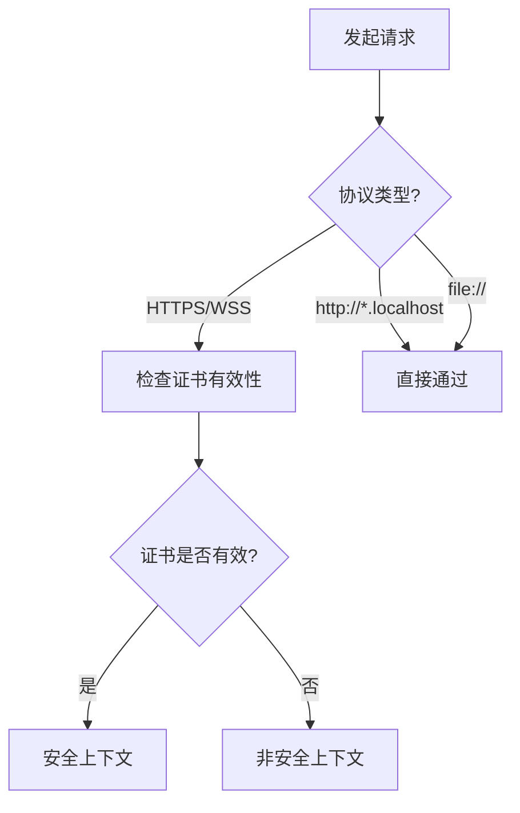

## 1. 概念解析

### 技术原理
安全上下文（Secure Context）是现代浏览器实施的安全沙箱机制，要求页面必须通过 HTTPS 或本地传输协议访问，才能访问敏感 API。该机制通过加密传输层（TLS）和严格来源验证，阻断中间人攻击（Man-in-the-Middle Attack）窃取用户凭证的可能。

### 适用场景
- 支付系统等涉及敏感操作的 Web 应用
- Service Workers/Payment Request 等现代 API 使用场景
- 混合内容（Mixed Content）环境下的资源加载控制

### 技术对比
| 方案        | 安全性 | 兼容性 | 部署成本 |
|-----------|-----|-----|-------|
| HTTP      | 低   | 优   | 低     |
| HTTPS     | 高   | 良   | 中     |
| 本地文件协议   | 中   | 差   | 低     |



## 2. 最佳实践

### 准则 1：强制 HTTPS 部署
**原理**：TLS 加密防止传输层数据泄露  
**步骤**：
1. 使用 Let's Encrypt 申请免费证书
2. 配置服务器 301 重定向
3. 部署 HSTS 响应头（Strict-Transport-Security: max-age=31536000）  
**误区警示**：忽略子资源混合加载问题  
**性能指标**：TLS 握手时间 < 300 ms（基于真实用户监控数据）

### 准则 2：本地开发环境配置
**原理**：现代浏览器将 localhost 识别为安全源  
**步骤**：
```bash
# 生成自签名证书（Node.js 环境）
openssl req -x509 -newkey rsa:4096 -keyout key.pem -out cert.pem -days 365 -nodes
```
**误区警示**：使用 127.0.0.1 可能触发混合内容警告  
**性能指标**：本地开发服务器启动时间 < 2 s（基于 M 1 Mac 测试）

## 3. 代码实验室

### 案例 1：基础检测
```html
<!-- 环境要求：HTTPS 服务器或本地文件 -->
<script>
try {
  if (window.isSecureContext) {
    const status = typeof navigator.serviceWorker !== 'undefined' ? '可用' : '不可用';
    console.log('[安全上下文] Service Worker 状态:', status);
  } else {
    throw new Error('非安全上下文');
  }
} catch (e) {
  console.error('安全检测失败:', e.message);
}
</script>
```
**预期输出**：`[安全上下文] Service Worker 状态: 可用`  
**异常处理**：捕获 SecurityError 时检查证书链完整性

### 案例 2：生产级 Service Worker 注册
```javascript
// 环境要求：Node.js 14+，支持 ES6 的浏览器
if ('serviceWorker' in navigator && window.isSecureContext) {
  const swTimeout = setTimeout(() => {
    console.warn('Service Worker 注册超时');
  }, 5000);

  navigator.serviceWorker.register('/sw.js', { scope: '/' })
    .then(reg => {
      clearTimeout(swTimeout);
      reg.update(); // 主动更新脚本
      console.log('SW 注册成功:', reg.scope);
    })
    .catch(err => {
      console.error('SW 注册失败:', err);
    });
}
```
**性能优化**：
- 预缓存关键资源
- 实现 stale-while-revalidate 策略
- 网络超时控制（3 秒回退）

### 案例 3：安全 WebSocket 连接
```javascript
// 环境要求：WSS 协议，现代浏览器
const socket = new WebSocket('wss://api.example.com/ws');

socket.addEventListener('open', event => {
  if (!window.isSecureContext) {
    socket.close(1002, 'Insecure context');
    return;
  }
  console.log('安全连接已建立');
});

socket.addEventListener('error', error => {
  console.error('连接异常:', error.type);
});
```
**预期输出**：`安全连接已建立`  
**异常处理**：监听 error 事件处理证书错误

## 4. 延伸学习
1. [W3C Secure Contexts 规范](https://w3c.github.io/webappsec-secure-contexts/)
2. [MDN Web 安全指南](https://developer.mozilla.org/zh-CN/docs/Web/Security)
3. [OWASP 传输层保护指南](https://cheatsheetseries.owasp.org/cheatsheets/Transport_Layer_Protection_Cheat_Sheet.html)
4. [Chrome 安全功能更新日志](https://www.chromium.org/Home/chromium-security/)
5. [Web 安全最佳实践白皮书](https://google.github.io/WebFundamentals/security/)
