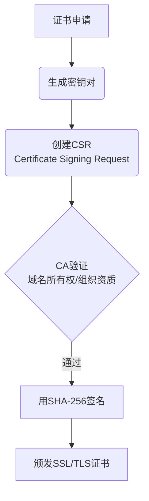

## 1. 概念解析
### 1.1 数字签名技术原理
数字证书采用非对称加密体系，通过哈希算法（Hash Algorithm）生成消息摘要，再用私钥加密形成数字签名。当客户端验证时，使用公钥解密签名并与重新计算的摘要比对，确保数据完整性和来源可靠性。哈希算法的抗碰撞性（Collision Resistance）是系统安全的核心保障。

### 1.2 算法生命周期演进
SHA-1（Secure Hash Algorithm 1）和 MD 5（Message-Digest Algorithm 5）因碰撞攻击（Collision Attack）风险被逐步淘汰。现代浏览器遵循以下演进路线：

- **2012 年**：MD 5 全面弃用
- **2017 年**：SHA-1 停止信任
- **当前标准**：SHA-2 系列（SHA-256/SHA-384/SHA-512）



## 2. 最佳实践
### 2.1 证书升级三原则
#### 原则 1：停止签发 SHA-1 证书
- **原理**：预计算攻击成本已低于$50 万
- **实施步骤**：
  1. 审计现有证书：`openssl x509 -text -noout -in cert.pem | grep "Signature Algorithm"`
  2. 签发新证书强制使用 SHA-256
  3. 配置证书自动续期系统
- **常见误区**：认为内网证书无需升级
- **性能指标**：RSA 2048 位签名速度≥500 次/秒（E 5-2678 v 3）

#### 原则 2：中间件算法黑名单
- **原理**：防御降级攻击（Downgrade Attack）
- **实施步骤**（Nginx 示例）：
  ```nginx
  ssl_protocols TLSv1.2 TLSv1.3;
  ssl_ciphers 'ECDHE-ECDSA-AES128-GCM-SHA256:ECDHE-RSA-AES128-GCM-SHA256';
  ssl_prefer_server_ciphers on;
  ```
- **常见误区**：仅禁用服务端算法而忽略客户端协商
- **性能指标**：TLS 握手时间≤300 ms（RTT=50 ms）

## 3. 代码实验室
### 3.1 基础实现：生成合规证书
```bash
# 环境要求：OpenSSL 1.1.1+
# 生成ECC密钥对和SHA-256证书
openssl req -x509 -newkey ec:<(openssl ecparam -name secp384r1) \
  -sha256 -days 90 \
  -keyout server.key -out server.crt \
  -subj "/CN=modern.example" \
  -addext "subjectAltName=DNS:modern.example"

# 验证签名算法
openssl x509 -in server.crt -text -noout | grep "Signature Algorithm"
```
**预期输出**：
```
Signature Algorithm: sha256WithRSAEncryption
```
**异常处理**：若出现 `SSL_ERROR_UNSUPPORTED_SIGNATURE_ALGORITHM` 错误，检查中间件是否支持 ECDSA 密钥

### 3.2 生产级优化：OCSP 装订配置
```nginx
# nginx.conf 安全配置片段
ssl_stapling on;
ssl_stapling_verify on;
resolver 8.8.8.8 valid=300s;

ssl_certificate /etc/ssl/modern.crt;
ssl_certificate_key /etc/ssl/modern.key;
ssl_dhparam /etc/ssl/dhparam.pem;

# 启用HSTS预加载
add_header Strict-Transport-Security "max-age=63072000; includeSubDomains; preload";
```
**性能影响**：OCSP 装订可减少 TLS 握手时间约30%

### 3.3 扩展应用：代码签名验证
```powershell
# 验证Windows二进制文件签名
Get-AuthenticodeSignature -FilePath app.exe | 
Where-Object { $_.SignatureAlgorithm -notmatch "sha256" } |
Select-Object StatusMessage, SignerCertificate
```
**合规标准**：EV Code Signing 证书必须使用 SHA-256

## 4. 延伸学习
1. [Mozilla CA证书维护政策](https://wiki.mozilla.org/CA) - 权威 CA 行为规范
2. [NIST SP 800-78-4](https://csrc.nist.gov/publications/detail/sp/800-78/4/final) - 密码算法迁移指南
3. [Let's Encrypt ACME协议](https://letsencrypt.org/docs/) - 自动化证书管理实现
4. [Cloudflare SSL配置生成器](https://ssl-config.mozilla.org/) - 多场景中间件配置
5. 《Applied Cryptography》第 19 章 - 数字签名系统设计范式

> 通过持续监控和自动化更新机制，可确保数字证书体系始终符合最新安全标准。建议每季度执行一次完整的安全审计，特别关注证书链中的中间 CA 签名算法。
